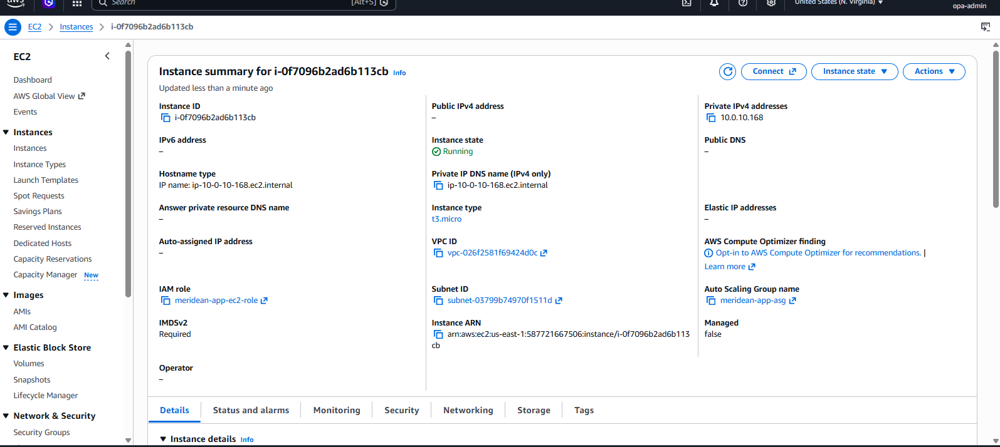
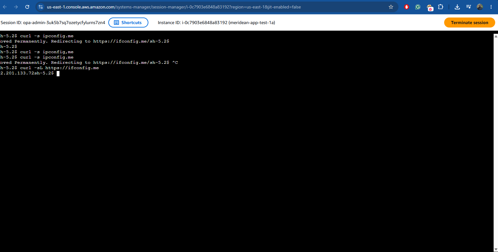
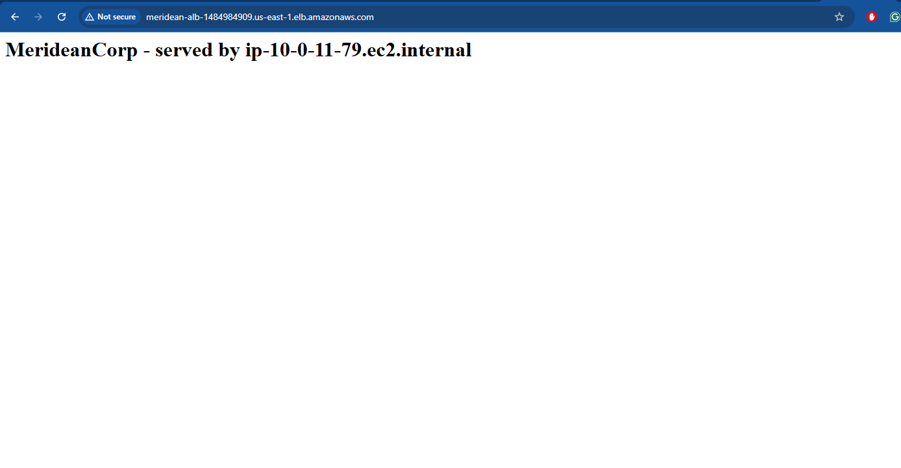
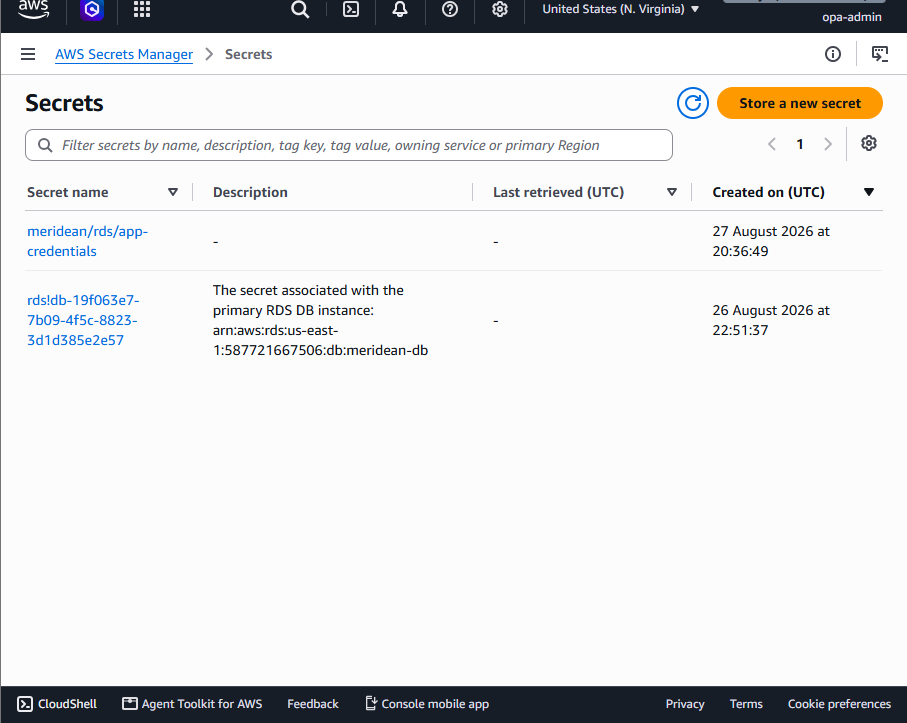
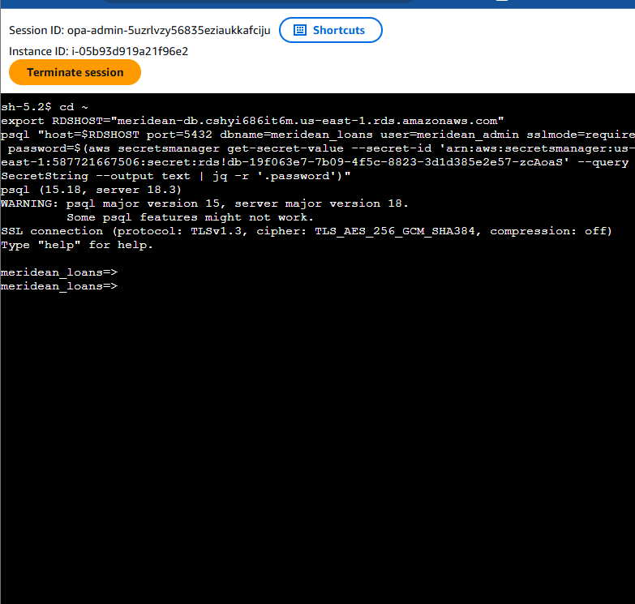
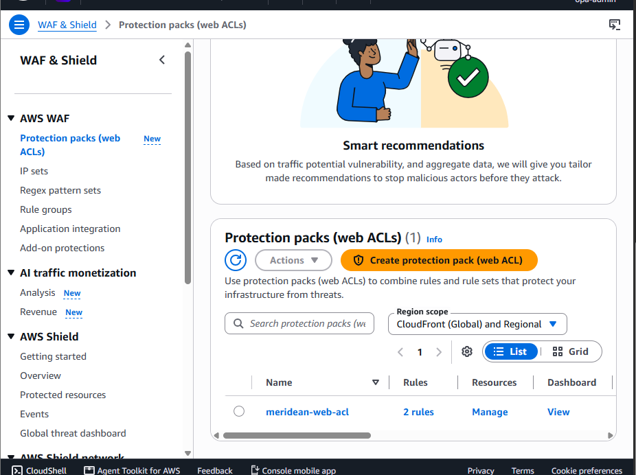

# Network & Security Verification

This document walks through the evidence proving the Phase 1 network design actually works as designed, not just as configured.

Screenshots referenced below live in `../screenshots/` — see `screenshots/checklist.md` for the full capture list.

## 1. Private Subnet, No Public IP, IAM-Based Access

A test EC2 instance was launched in the private app subnet (`meridean-app-1a`) with no key pair and no public IP assigned. Access was verified entirely through AWS Systems Manager Session Manager — no SSH, no open port 22, no exposed credentials. Every session is attributable to an IAM identity and logged, directly satisfying the "individually attributable access" requirement.




## 2. Outbound Routing Through NAT (Not Direct Internet Access)

From within the Session Manager session, `curl -sL https://ifconfig.me` returned one of the NAT Gateway's Elastic IPs — not a public IP on the instance itself — confirming outbound traffic correctly routes: private subnet → NAT Gateway → Internet Gateway, with the instance itself never directly internet-facing.


## 3. Load Balancing Across Instances

The ALB distributes traffic across both ASG instances. Repeated requests to the ALB's DNS name returned alternating hostnames in the response body, confirming the Auto Scaling Group and Target Group are correctly registered and healthy.



## 4. End-to-End Data Tier Access (EC2 → Secrets Manager → RDS)

Database credentials were never hardcoded. From a Session Manager session on an app-tier instance, credentials were retrieved via the IAM role's scoped `secretsmanager:GetSecretValue` permission (restricted to a single secret ARN, not `*`), then used to establish an encrypted connection to RDS in the isolated data subnet.

```
aws secretsmanager get-secret-value --secret-id meridean/rds/app-credentials ...
psql "host=$RDSHOST ... sslmode=require ..."
```

This proves the full security chain functions together: private compute → least-privilege IAM → managed secret → encrypted connection → isolated data tier.





## 5. WAF Active, Legitimate Traffic Unaffected

AWS WAF (Core rule set + Known bad inputs managed rule groups) is attached to the ALB. The application remained reachable and functional after WAF was attached, confirming the rule set doesn't block legitimate traffic while providing baseline protection against common web exploits.


