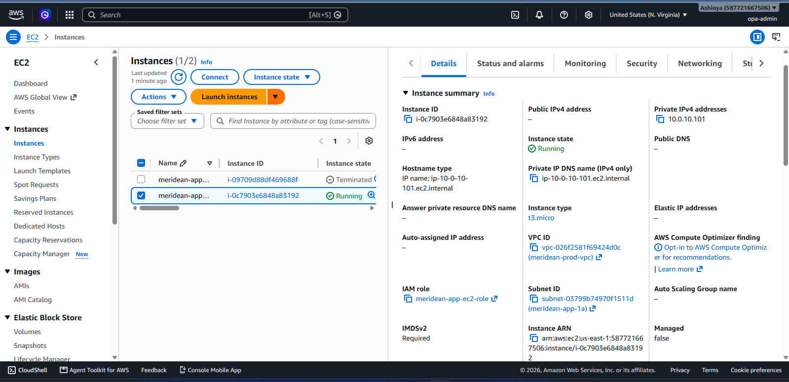
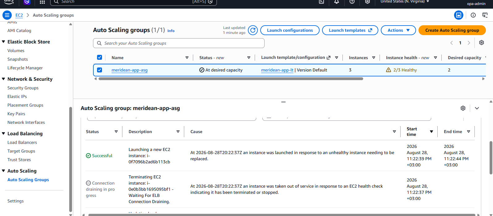
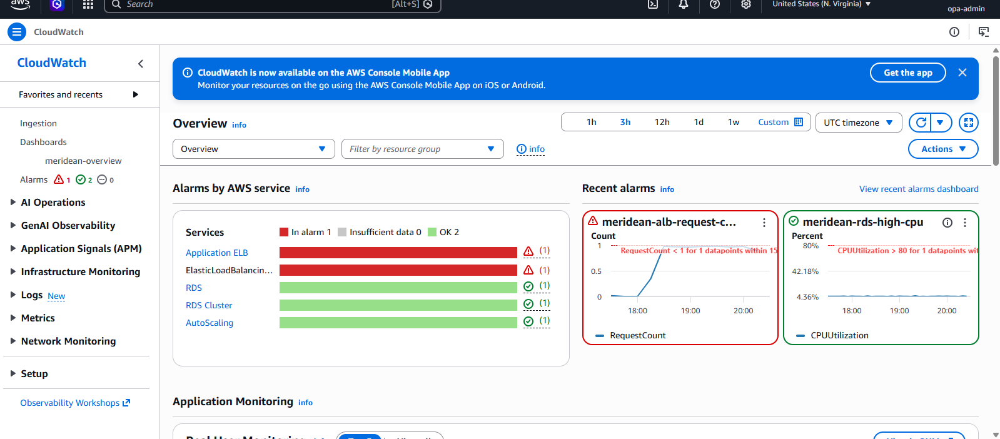

# Failure Testing: Instance Termination & Auto-Recovery

Most portfolio projects describe resilience. This document demonstrates it, with a real, deliberate failure injected into a running system.

## Test

**Action:** Manually terminated one of two running instances in the Auto Scaling Group (`meridean-app-asg`), mid-session, with no advance preparation beyond having the ASG, ALB, and CloudWatch dashboard already in place.

**Expected behavior:** The ASG detects the instance count dropping below the desired capacity (2) and launches a replacement automatically. The ALB continues serving traffic from the surviving instance throughout, with zero manual intervention.

## Observed Result

1. **ASG Activity tab** — recorded the termination and, within roughly a minute, an automatic "launch" action to replace the terminated instance, bringing the group back to the desired count of 2.
2. **Target Group** — the terminated instance's target was deregistered; the new instance registered and transitioned from `initial` → `healthy` automatically, with no manual registration step.
3. **ALB availability** — the application remained reachable via the ALB's DNS name throughout the test. The surviving instance continued serving requests while the replacement spun up and passed health checks.
4. **New instance verified serving traffic** — after the replacement reached `healthy`, repeated requests to the ALB began showing the new instance's hostname in rotation alongside the original, confirming it was actually serving traffic, not just marked healthy.

## What This Proves

- The Auto Scaling Group's self-healing behavior works as designed, not just as configured — this was a real instance termination, not a simulated/described scenario.
- The three-AZ, ALB-fronted design meant the loss of 50% of compute capacity produced no observed customer-facing downtime.
- CloudWatch alarms tied to `GroupInServiceInstances` would have fired an alert during the dip in a real operational setting (SNS topic `meridean-alerts`), meaning an on-call engineer would have been notified even if they weren't watching the console live.

## Limitations of This Test

This validates instance-level failure recovery only. It does not test:
- AZ-level failure (all instances in one AZ going down simultaneously)
- RDS failure/recovery (currently Single-AZ — see ADR-003 — so this specific failure mode isn't yet demonstrable in this environment)
- Sustained load during recovery (this test was performed with negligible traffic, not under load)
